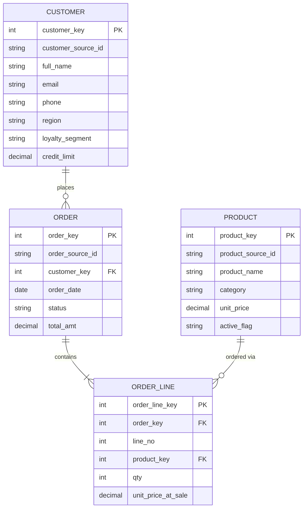

# Expected Output — Stage 3 & 4: 3NF Style
### Golden Dataset: Retail Sales

## Stage 3 — Logical Data Model (3NF)

| Entity | Attributes | PK | FK |
|---|---|---|---|
| CUSTOMER | customer_key(PK,surrogate), customer_source_id, full_name, email, phone, region, loyalty_segment, credit_limit | customer_key | — |
| ORDER | order_key(PK,surrogate), order_source_id, customer_key(FK), order_date, status, total_amt | order_key | customer_key → CUSTOMER |
| ORDER_LINE | order_line_key(PK,surrogate), order_key(FK), line_no, product_key(FK), qty, unit_price_at_sale | order_line_key | order_key → ORDER; product_key → PRODUCT |
| PRODUCT | product_key(PK,surrogate), product_source_id, product_name, category, unit_price, active_flag | product_key | — |

**Normalization notes**: `unit_price_at_sale` stays on ORDER_LINE (not derivable from PRODUCT — it's a fact at time of sale, correctly not normalized away per 3NF's "depends on the key, whole key, nothing but the key" — it depends on the ORDER_LINE event, not on PRODUCT). No historization attributes added anywhere — pure 3NF does not carry change history; if Product/Customer versioning is required, this is a signal to prefer Canonical or Data Vault (flagged, matches Stage 2 recommendation).

**Constraints derived from Stage 1 profiling**: `email` NOT NULL + UNIQUE (0% null observed); `phone` nullable (20% null observed, C1003); `total_amt` NOT NULL, allows zero (Cancelled orders confirmed valid at Gate 1).

## Stage 4 — Physical Data Model (3NF)

See `ddl_3nf.sql` for full DDL. Table naming: snake_case, `_key` suffix for surrogate keys.

### Final ER Diagram (3NF)

### Golden Row-Level Expectation (traceability check)
After dedup (Gate 1/2 decisions), CUSTOMER should have exactly **6 rows** (Alice, Rahul, Sara, John, Divya, Karthik) — a failing agent that didn't apply the identity-resolution decision will produce 9 rows (5 CRM + 4 ERP, no merge). ORDER should have exactly **5 rows**, ORDER_LINE **7 rows**, PRODUCT **4 rows** (current state only — 3NF does not retain the load1/load2 price history, only the latest values from products_load2).
