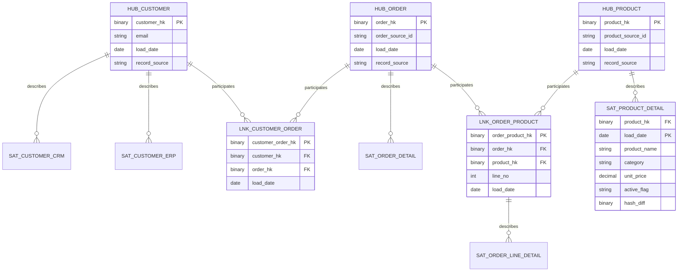

# Expected Output — Stage 3 & 4: Data Vault 2.0 Style
### Golden Dataset: Retail Sales

## Stage 3 — Logical Data Model (Data Vault)

### Hubs
| Hub | Business Key | Notes |
|---|---|---|
| HUB_CUSTOMER | email (chosen over source-specific IDs — it's the one attribute stable across both CRM and ERP, per Stage 1 relationship discovery) | business key retained + hash key |
| HUB_ORDER | order_source_id (orders.order_id) | — |
| HUB_PRODUCT | product_source_id (products.product_id) | — |

### Links
| Link | Connects | Notes |
|---|---|---|
| LNK_CUSTOMER_ORDER | HUB_CUSTOMER, HUB_ORDER | represents "Customer places Order" |
| LNK_ORDER_PRODUCT | HUB_ORDER, HUB_PRODUCT | represents the Order Line association; carries no descriptive attributes itself (those live in a satellite) |

### Same-As Link
| Link | Purpose |
|---|---|
| LNK_SAME_AS_CUSTOMER | Explicitly links `crm_customers.cust_id`-sourced hash and `erp_customers.customer_no`-sourced hash to the same HUB_CUSTOMER business key (email), per the Stage 1 identity-resolution flag. **This is the Data Vault-native way of recording the CRM/ERP dedup decision — never a silent merge.** |

### Satellites
| Satellite | Parent | Attributes | Source | Change Frequency |
|---|---|---|---|---|
| SAT_CUSTOMER_CRM | HUB_CUSTOMER | full_name, phone, signup_date, loyalty_segment | crm_customers | low |
| SAT_CUSTOMER_ERP | HUB_CUSTOMER | cust_name, region, credit_limit | erp_customers | low |
| SAT_ORDER_DETAIL | HUB_ORDER | order_date, status, total_amt | orders | low (append-only, but status could change Pending→Shipped→Cancelled, hence a satellite not a hub attribute) |
| SAT_ORDER_LINE_DETAIL | LNK_ORDER_PRODUCT | qty, unit_price_at_sale, line_no | order_lines | none observed (immutable once created) |
| SAT_PRODUCT_DETAIL | HUB_PRODUCT | product_name, category, unit_price, active_flag | products | **high — this is the satellite that captures the load1→load2 price/active_flag change via hash_diff** |

### PIT/Bridge Advisory
- HUB_PRODUCT flagged as a PIT candidate: two satellite loads observed with attribute changes (price 750→799, active_flag N→Y) — a query-layer PIT view is recommended once satellite volume grows.

## Stage 4 — Physical Data Model (Data Vault)

See `ddl_datavault.sql`. Hash algorithm: SHA-256 of trimmed, upper-cased, pipe-delimited business key. Load pattern: insert-only for Hubs/Links; insert-only with hash_diff change detection for Satellites.

### Final ER Diagram (Data Vault)

### Golden Row-Level Expectation (traceability check)
- HUB_CUSTOMER: **6 rows** (one per unique email)
- SAT_CUSTOMER_CRM: 5 rows (only CRM-sourced customers), SAT_CUSTOMER_ERP: 4 rows (only ERP-sourced) — **a failing agent that puts all attributes in one satellite instead of splitting by source is a defect to catch here**
- SAT_PRODUCT_DETAIL: **8 rows** (4 products × 2 loads) if every attribute set differs, but P-02 and P-03 are identical across load1/load2 → hash_diff matches → **no second row inserted** for those two. Correct output: 6 rows (P-01: 2 versions, P-04: 2 versions, P-02: 1 version, P-03: 1 version). This is the single most important row-count check for validating hash_diff logic.
