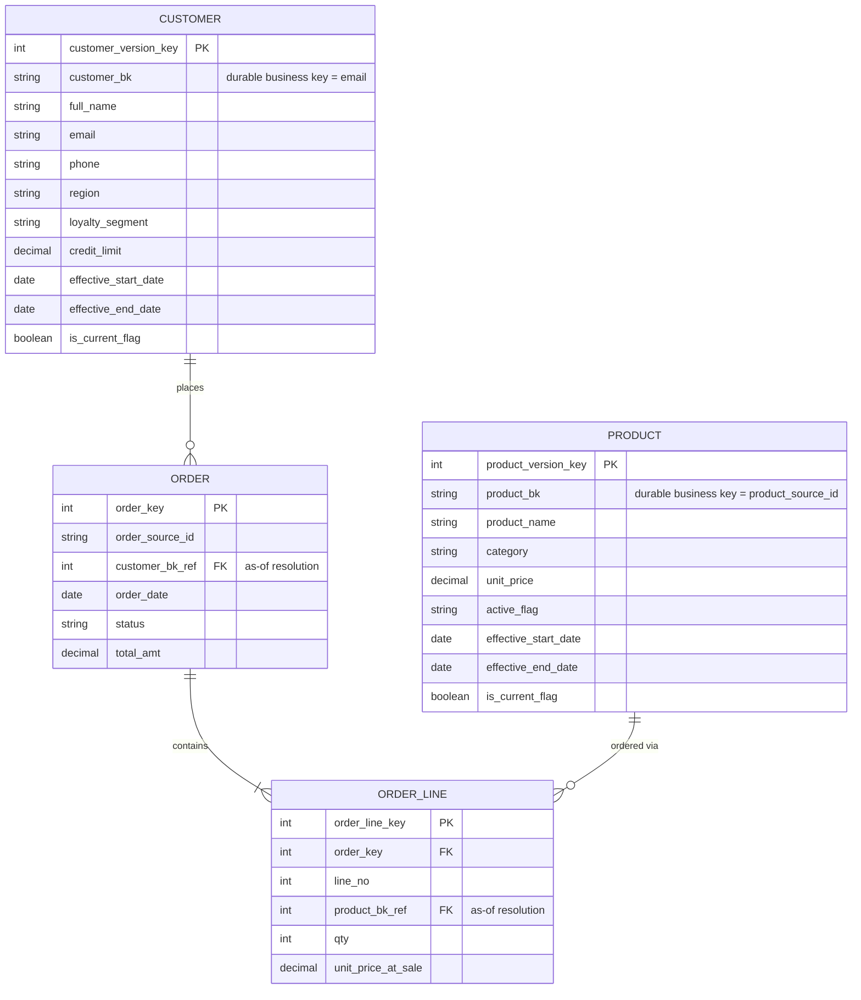

# Expected Output — Stage 3 & 4: Canonical / Hybrid Style
### Golden Dataset: Retail Sales

## Stage 3 — Logical Data Model (Canonical)

Per the Stage 2 recommendation: **Customer = historized, Product = historized, Order/Order Line = stable.**

| Entity | Classification | Rationale |
|---|---|---|
| CUSTOMER | historized | regulatory-relevant PII (Stage 1 GDPR flag) + plausible attribute drift (region/segment) |
| PRODUCT | historized | Stage 1 profiling directly observed price + active_flag changes between load1/load2 |
| ORDER | stable | transactional, no attribute change pattern observed beyond status progression which is captured as current value, not versioned in this golden set |
| ORDER_LINE | stable | immutable once created — no updates observed |

### Historized Entity: CUSTOMER
| Attribute | triggers_new_version? |
|---|---|
| full_name, email | No (corrected in place if wrong) |
| region, loyalty_segment, credit_limit | **Yes** — these are the attributes expected to actually change over a customer's lifecycle |
| phone | No (correction, not a meaningful version event) |

Keys: `customer_bk` (durable, = email) + `customer_version_key` (surrogate, per version row) + `effective_start_date` / `effective_end_date` / `is_current_flag`.

### Historized Entity: PRODUCT
| Attribute | triggers_new_version? |
|---|---|
| product_name, category | No |
| unit_price, active_flag | **Yes** — exactly the two attributes the golden dataset changes between load1/load2 |

Keys: `product_bk` (durable, = product_source_id) + `product_version_key` (surrogate) + effective-dating columns.

### Stable Entities: ORDER, ORDER_LINE
Same structure as the 3NF walkthrough (surrogate PK, standard FKs) — no versioning attributes.

### Relationship Resolution
| From | To | Type |
|---|---|---|
| ORDER → CUSTOMER | as-of (order should reference the customer version current at order_date, per Data Vault-adjacent as-of semantics) |
| ORDER_LINE → PRODUCT | as-of (unit_price_at_sale already captures point-in-time price on the fact row, but the reference to which Product version was "current" at time of sale is still useful for audit) |

## Stage 4 — Physical Data Model (Canonical)

See `ddl_canonical.sql`. Companion current-views generated for CUSTOMER and PRODUCT (`vw_customer_current`, `vw_product_current`).

### Final ER Diagram (Canonical)

### Golden Row-Level Expectation (traceability check)
- CUSTOMER: **6 current rows**, no historical versions yet (only one load of CRM/ERP customer data supplied in this golden set — CUSTOMER versioning logic is structurally testable but this dataset alone won't produce a second version; to fully exercise it, add a `crm_customers_load2.csv` with a changed `loyalty_segment` for one customer)
- PRODUCT: **6 rows total** — same as Data Vault satellite result: P-01 2 versions, P-04 2 versions, P-02 1 version, P-03 1 version (only 4 rows have `is_current_flag = TRUE`)
- `vw_product_current` should return exactly **4 rows** (one per product_bk)
- ORDER: 5 rows, ORDER_LINE: 7 rows (identical to 3NF — stable entities behave the same way regardless of style)
